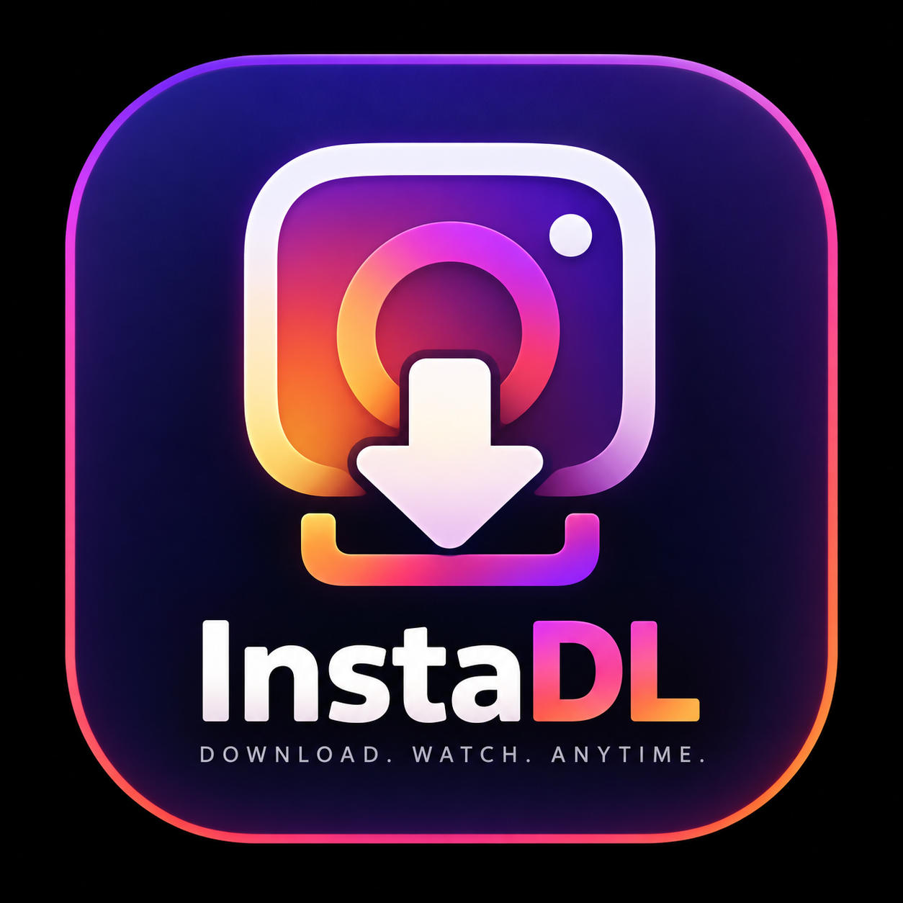

# InstaDL

<p align="center">
  
</p>

<p align="center">
  <strong>A lightweight Python CLI for downloading public Instagram videos and Reels in the highest quality available.</strong>
</p>

<p align="center">
  Built with Python, yt-dlp and FFmpeg.
</p>

---

InstaDL is a lightweight Python CLI for downloading **public Instagram videos and Reels** in the highest quality available.

InstaDL uses [yt-dlp](https://github.com/yt-dlp/yt-dlp) to retrieve Instagram media and **FFmpeg** to merge the highest-quality video and audio streams when they are provided separately.

The project can also be compiled into a **standalone Windows application**, allowing InstaDL to run without requiring Python, yt-dlp, or FFmpeg to be installed separately on the user's system.

## Features

- Download public Instagram Reels and video posts
- Automatically select the highest-quality video stream
- Automatically select the highest-quality audio stream
- Merge separate video and audio streams into MP4
- Automatically detect the current Windows user
- Save downloads to the user's `Videos\instadl` directory
- Display download progress, speed, and ETA
- Retry temporary download failures
- Support direct URLs through command-line arguments
- Modular Python architecture
- Standalone Windows executable
- Bundled Python runtime
- Bundled yt-dlp
- Bundled FFmpeg and FFprobe
- No Python installation required for the compiled application
- No system-wide FFmpeg installation required for the compiled application

## Project Structure

```text
instadl/
│
├── index.py
├── setup.spec
├── requirements.txt
├── requirements-dev.txt
├── README.md
├── LICENSE
├── .gitignore
│
├── assets/
│   ├── instadl.ico
│   └── instadl.png
│
├── bin/
│   ├── ffmpeg.exe
│   └── ffprobe.exe
│
└── instadl/
    ├── __init__.py
    ├── config.py
    ├── downloader.py
    ├── progress.py
    ├── runtime.py
    └── validators.py
```

## Modules

| File | Purpose |
| --- | --- |
| `index.py` | Application entry point and CLI handling |
| `instadl/config.py` | Download and yt-dlp configuration |
| `instadl/downloader.py` | Instagram download logic |
| `instadl/progress.py` | Download progress handling |
| `instadl/runtime.py` | Runtime and bundled dependency path resolution |
| `instadl/validators.py` | Instagram URL validation |
| `instadl/__init__.py` | Python package initialization |
| `setup.spec` | PyInstaller standalone application configuration |
| `bin/ffmpeg.exe` | Bundled FFmpeg executable |
| `bin/ffprobe.exe` | Bundled FFprobe executable |
| `assets/instadl.ico` | Windows executable icon |
| `assets/instadl.png` | Project logo used by GitHub and documentation |

## Standalone Windows Application

InstaDL can be distributed as a standalone Windows application.

The compiled version includes the required runtime components and dependencies, including:

- Python runtime
- yt-dlp
- FFmpeg
- FFprobe
- InstaDL modules and dependencies

Users of the compiled application therefore **do not need to install Python, pip, yt-dlp, or FFmpeg separately**.

The standalone distribution has the following structure:

```text
InstaDL/
│
├── InstaDL.exe
│
└── _internal/
    ├── bin/
    │   ├── ffmpeg.exe
    │   └── ffprobe.exe
    │
    └── ...
```

Run the application:

```powershell
.\InstaDL.exe
```

InstaDL will prompt for an Instagram URL.

You can also provide the URL directly:

```powershell
.\InstaDL.exe "https://www.instagram.com/reel/XXXXXXXXXXX/"
```

Downloaded videos are automatically stored in:

```text
C:\Users\<USERNAME>\Videos\instadl
```

## Requirements

### Standalone Application

If you are using the compiled `InstaDL.exe` release, there are no separate Python or FFmpeg installation requirements.

The application includes the dependencies required to run InstaDL.

### Running from Source

Developers running InstaDL directly from its Python source require:

- Python 3.10+
- yt-dlp
- FFmpeg and FFprobe

The project is currently designed primarily for **Windows**.

## Installation from Source

### 1. Clone the repository

```powershell
git clone https://github.com/WissemHammami009/instadl.git
cd instadl
```

### 2. Create a virtual environment

```powershell
py -m venv .venv
```

Activate it:

```powershell
.\.venv\Scripts\Activate.ps1
```

If PowerShell prevents script execution, you can activate the environment from Command Prompt instead:

```cmd
.venv\Scripts\activate.bat
```

### 3. Install Python dependencies

```powershell
py -m pip install --upgrade pip
py -m pip install -r requirements.txt
```

The main runtime dependency is:

```text
yt-dlp
```

## FFmpeg

FFmpeg is used when Instagram provides the highest-quality video and audio as separate streams.

InstaDL uses FFmpeg to merge those streams into the final video.

### Standalone Build

The standalone Windows application includes:

```text
bin/
├── ffmpeg.exe
└── ffprobe.exe
```

The application automatically detects the bundled binaries at runtime.

No system-wide FFmpeg installation is required.

### Development

When running from source, the project expects the FFmpeg binaries under:

```text
bin/
├── ffmpeg.exe
└── ffprobe.exe
```

You can verify them with:

```powershell
.\bin\ffmpeg.exe -version
.\bin\ffprobe.exe -version
```

## Usage

### Standalone Application

Interactive mode:

```powershell
.\InstaDL.exe
```

InstaDL will ask for an Instagram URL:

```text
Paste public Instagram Reel URL:
```

Paste a public Reel or video-post URL and press Enter.

You can also pass the URL directly:

```powershell
.\InstaDL.exe "https://www.instagram.com/reel/XXXXXXXXXXX/"
```

### Running from Source

Interactive mode:

```powershell
py .\index.py
```

Or provide the URL directly:

```powershell
py .\index.py "https://www.instagram.com/reel/XXXXXXXXXXX/"
```

Regular public Instagram video posts are also supported when yt-dlp can extract them:

```powershell
py .\index.py "https://www.instagram.com/p/XXXXXXXXXXX/"
```

## Download Location

InstaDL automatically detects the currently logged-in Windows user's home directory.

Downloads are stored in:

```text
C:\Users\<USERNAME>\Videos\instadl
```

For example:

```text
C:\Users\John\Videos\instadl
```

The directory is automatically created if it does not already exist.

This behavior is configured using:

```python
DOWNLOAD_FOLDER = Path.home() / "Videos" / "instadl"
```

This means the Windows username does not need to be hard-coded.

If another Windows user runs InstaDL, the downloader automatically uses that user's `Videos\instadl` directory.

## Download Quality

InstaDL uses the following yt-dlp format selection:

```python
"format": "bestvideo*+bestaudio/best"
```

The downloader therefore attempts to retrieve:

1. The best available video stream
2. The best available audio stream
3. The best combined stream as a fallback

When the highest-quality video and audio are provided as separate streams, FFmpeg merges them into the final MP4 file.

The resulting quality depends on the streams made available by Instagram.

## Example

```text
============================================================
InstaDL
============================================================
URL    : https://www.instagram.com/reel/XXXXXXXXXXX/
Folder : C:\Users\John\Videos\instadl

[Instagram] Extracting URL...
[info] Downloading formats...

Downloading: 45.2% | Speed: 5.3MiB/s | ETA: 00:03
Downloading: 100.0% | Speed: 6.1MiB/s | ETA: 00:00

Download finished. Processing video...

============================================================
DOWNLOAD COMPLETE
============================================================
Title    : Example Video
Uploader : example_user
ID       : XXXXXXXXXXX
Quality  : 1080x1920
Folder   : C:\Users\John\Videos\instadl
```

## Building the Standalone Application

InstaDL uses **PyInstaller** to generate a standalone Windows application.

### 1. Install Development Dependencies

Create or activate your virtual environment:

```powershell
py -m venv .venv
.\.venv\Scripts\Activate.ps1
```

Install the development dependencies:

```powershell
py -m pip install -r requirements-dev.txt
```

A typical `requirements-dev.txt` contains:

```text
-r requirements.txt
pyinstaller
```

Alternatively, install PyInstaller directly:

```powershell
py -m pip install pyinstaller
```

Verify:

```powershell
py -m PyInstaller --version
```

### 2. Verify FFmpeg

Make sure these files exist:

```text
bin/
├── ffmpeg.exe
└── ffprobe.exe
```

Verify them:

```powershell
.\bin\ffmpeg.exe -version
.\bin\ffprobe.exe -version
```

### 3. Verify the Application Icon

The Windows executable icon should exist at:

```text
assets/instadl.ico
```

The GitHub/documentation logo should exist at:

```text
assets/instadl.png
```

### 4. Clean Previous Builds

Before creating a new release:

```powershell
Remove-Item -Recurse -Force .\build -ErrorAction SilentlyContinue
Remove-Item -Recurse -Force .\dist -ErrorAction SilentlyContinue
```

### 5. Build

Run:

```powershell
py -m PyInstaller --clean --noconfirm setup.spec
```

PyInstaller will generate:

```text
dist/
└── InstaDL/
    ├── InstaDL.exe
    └── _internal/
        └── ...
```

The `InstaDL.exe` executable contains the custom InstaDL application icon.

## PyInstaller Configuration

The `setup.spec` configuration is responsible for packaging:

- InstaDL source modules
- Python runtime
- yt-dlp and its required modules
- FFmpeg
- FFprobe
- Application metadata
- Windows application icon

The FFmpeg binaries are copied into the packaged application and located automatically at runtime.

This allows the final application to operate independently of the Python and FFmpeg installations on the user's computer.

## Updating yt-dlp

Instagram can change how its website and media delivery work over time.

### Source Installation

If downloads unexpectedly stop working, update yt-dlp:

```powershell
py -m pip install -U yt-dlp
```

If you're using the project's virtual environment:

```powershell
.\.venv\Scripts\Activate.ps1
py -m pip install -U yt-dlp
```

After updating yt-dlp, rebuild the standalone application if you want the newer version included in `InstaDL.exe`.

```powershell
py -m PyInstaller --clean --noconfirm setup.spec
```

### Standalone Release

Users of the standalone release cannot update its bundled yt-dlp package independently through `pip`.

A new InstaDL build must be released with the updated dependency.

## Troubleshooting

### `pip` is not recognized

You don't need to invoke `pip` directly.

Use:

```powershell
py -m pip install -r requirements.txt
```

To verify pip:

```powershell
py -m pip --version
```

### `python` is not recognized

On Windows, try the Python launcher:

```powershell
py --version
```

If Python is installed correctly, you can use `py` throughout the project.

### PyInstaller is not recognized

Instead of:

```powershell
pyinstaller setup.spec
```

use:

```powershell
py -m PyInstaller setup.spec
```

Verify the installation with:

```powershell
py -m PyInstaller --version
```

### FFmpeg is not found

For development, verify:

```powershell
.\bin\ffmpeg.exe -version
.\bin\ffprobe.exe -version
```

Make sure the project contains:

```text
bin/
├── ffmpeg.exe
└── ffprobe.exe
```

For standalone releases, these binaries should be included automatically by PyInstaller.

### Application Icon Does Not Update

Windows Explorer may cache application icons when repeatedly rebuilding an executable using the same filename.

If the newly built executable still displays an older icon, temporarily rename it:

```powershell
Rename-Item ".\dist\InstaDL\InstaDL.exe" "InstaDL-Test.exe"
```

If the new filename displays the correct icon, the executable itself is correct and Windows Explorer is displaying a cached icon.

### Instagram Download Fails

When running from source, first update yt-dlp:

```powershell
py -m pip install -U yt-dlp
```

Some Instagram content may require authentication, may be geographically restricted, may have been removed, or may not be accessible through yt-dlp.

Private Instagram content is outside the intended scope of InstaDL.

## Development

The application is intentionally split into small modules to make it easier to maintain and extend.

The current architecture separates:

- CLI handling
- Configuration
- Download logic
- Progress reporting
- Runtime dependency resolution
- URL validation
- Build configuration

To run the project during development:

```powershell
py .\index.py
```

Install or update dependencies with:

```powershell
py -m pip install -r requirements.txt
```

Build the standalone application with:

```powershell
py -m PyInstaller --clean --noconfirm setup.spec
```

## Roadmap

Potential future improvements include:

- [ ] Batch URL downloads
- [ ] Download history
- [ ] Configurable output directories
- [ ] Extended CLI arguments and options
- [ ] Improved logging
- [x] Bundled FFmpeg and FFprobe
- [x] Automatic bundled FFmpeg detection
- [x] Standalone Windows application
- [x] Custom application icon
- [ ] Duplicate-download detection
- [ ] Unit tests
- [ ] Windows installer
- [ ] Automatic update system
- [ ] GitHub release automation
- [ ] Installable Python package
- [ ] Native `instadl` CLI installation
- [ ] Additional public-video source support

## Contributing

Contributions, bug reports, and feature suggestions are welcome.

If you want to contribute:

1. Fork the repository
2. Create a feature branch
3. Make your changes
4. Commit your changes
5. Push the branch
6. Open a Pull Request

Example:

```bash
git checkout -b feat/my-feature
git commit -m "Add my feature"
git push origin feat/my-feature
```

## Disclaimer

InstaDL is intended for downloading **publicly accessible content that you own or have permission to download**.

Users are responsible for complying with applicable copyright laws, Instagram's terms, and the rights of content owners.

This project is not affiliated with, endorsed by, or sponsored by Instagram or Meta.

## License

This project is licensed under the **MIT License**.

See the [`LICENSE`](LICENSE) file for details.

---

<p align="center">
  
</p>

<p align="center">
  Developed by <a href="https://github.com/WissemHammami009">Wissem Hammami</a>
</p>